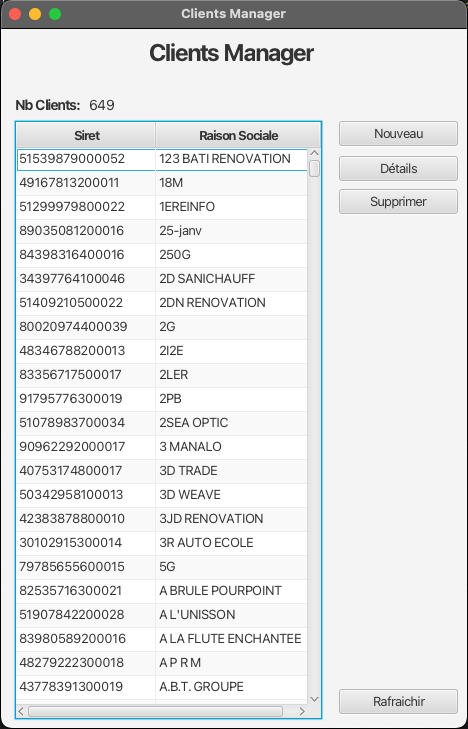
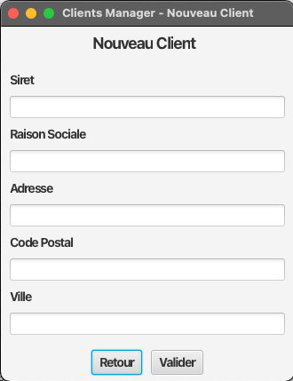
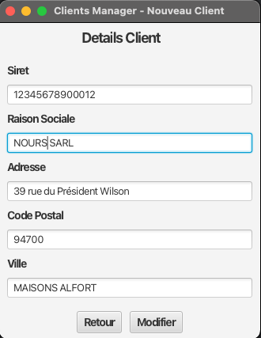

# TD 3 Java : Consommer une API REST

## Objectifs

Vous devez permettre à l'ébauche de l'application proposée de fournir une interface utlisateur permettant d'interagir avec une API REST.

## Installation de l'API Clients-api

- `docker compose up -d ` pour lancer l'API
- `docker compose down` pour arrêter l'API

Vous disposer de collectons de requêtes importables dans Postman ou Bruno pour tester l'API dans le dossier `docs/api-collections`

## Screenshots

### Ecran d'accueil

### Ecran de détail

### Ecran de création
